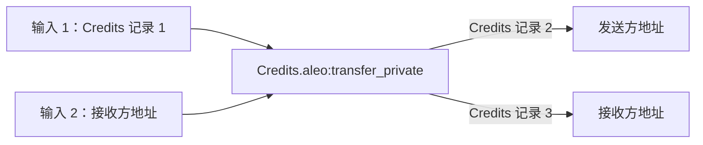

# 管理公共和私有状态

## 公共状态：映射

映射是在程序中定义的简单键值存储。每个映射由指定类型的键和值组成。映射会直接存储在 Aleo 区块链上，Aleo 网络中的任何参与者都可以公开读取。

`credits.aleo` 程序中的 `account` 映射就是一个典型示例，它在链上存储所有公开的 Aleo Credits 余额。它的结构在 [Aleo Credits](./transferring-tokens/aleo-credits) 中有说明。

### 初始化和更新映射

映射通过执行包含链上 `async` 块的程序函数来更新。例如，在调用 `credits.aleo` 中的 `transfer_public` 时，它会更新 `account` 映射。关于异步链上执行的工作方式，可以参考异步编程模型相关文档。

从 SDK 调用者的角度看，这和执行普通 Aleo 函数一样简单。更多信息可以参考 [Executing Programs](./executing-programs) 指南或 [Aleo Credits](./transferring-tokens/aleo-credits) 指南。

如果函数输入无效，网络会返回错误，但为该交易支付的费用仍会被消耗。因此，在执行前确认输入有效非常重要。

### 读取映射

程序映射中的任何状态都是公开的，Aleo 网络中的任何参与者都可以读取。`AleoNetworkClient` 类提供了 `getProgramMappingNames()` 方法来读取程序中的公共映射，并提供 `getProgramMappingValue()` 方法来读取某个映射中特定键的值。

```typescript
import { AleoNetworkClient } from '@provablehq/sdk';

const networkClient = new AleoNetworkClient("https://api.provable.com/v2");
const creditsMappings = await networkClient.getProgramMappingNames("credits.aleo");
// 预期映射：["committee", "delegated", "metadata", "bonded", "unbonding", "account", "withdraw", "pool"]

// <ADDRESS> = 一个余额为零的有效 Aleo 账户
const publicCredits = await networkClient.getProgramMappingValue("credits.aleo", "account", "<ADDRESS>");
// 如果地址没有公开余额，则返回 null；否则返回类似 "0u64" 的余额字符串
```

## 私有状态：记录

记录类似于 [UTXO](https://en.wikipedia.org/wiki/Unspent_transaction_output) 的概念。当程序创建一条记录后，同一个程序后续可以把它作为函数输入来消费。一旦记录被用作输入，它就会被视为已消费，不能再次使用。很多情况下，函数的输出会生成一条新的记录。记录默认是私有的，并且与单个 Aleo 程序以及代表用户的单个私钥相关联。更多信息可以参考 [Public and Private State](../../../learn/core-concepts/public-private-state)。

### 查找记录

查找记录和在 Bitcoin 中查找 UTXO 类似。记录作为执行交易中 transition 的输出存储。要查找记录，Web 应用实现者需要：

1. 扫描 Aleo 网络，找到包含记录的 transition 所在的交易。
2. 检查找到的记录，判断目标用户是否是该记录的所有者。
3. 通过检查该记录是否出现在任何函数输入中，判断它是已花费还是未花费。
4. 如果需要读取其中的数据，可以选择解密记录。

`AleoNetworkClient` 提供了用于查找记录的 `findRecords()` 方法。该方法允许在指定区块高度范围内搜索记录。

它还可以让用户选择性地指定：

- 是否只搜索未花费的记录。
- 要为一个或多个程序查找记录。
- 要从搜索中排除的 nonce 列表，也就是记录的唯一 ID。

如果搜索的是 `credits.aleo` 记录，用户还可以选择性地指定：

- 要查找的金额列表。
- 所有记录之间要查找的最大累计金额。

```typescript
import { Account, AleoNetworkClient } from '@provablehq/sdk';

const account = new Account({ privateKey: 'APrivateKey1...' });
const networkClient = new AleoNetworkClient("https://api.provable.com/v2");
networkClient.setAccount(account);

// 在一个区块范围内查找账户的所有记录。
const allRecords = await networkClient.findRecords(
    4370000, // 起始区块高度
    4371000, // 结束区块高度
    false, // 同时查找已花费和未花费的记录
    ["credits.aleo", "token_registry.aleo"], // 查找 credits.aleo 和 token_registry.aleo 程序的记录
);

// 在一个区块范围内只查找账户中可作为新函数输入的未花费记录。
const unspentRecords = await networkClient.findRecords(
    4370000, // 起始区块高度
    4371000, // 结束区块高度
    true, // 只查找未花费的记录
    ["credits.aleo", "token_registry.aleo"], // 查找 credits.aleo 和 token_registry.aleo 程序的记录
);
```

该方法会在指定的区块范围内进行线性搜索。它最适合在较小的区块范围中查找记录，前提是调用该方法的应用预期能在该范围内找到目标记录。对于较大的区块范围，这种方法可能并不现实。

#### 优化记录搜索

使用扫描整条区块链历史这样的朴素方法会非常耗时，也会降低 Web 应用的体验。幸运的是，可以使用一些策略来优化搜索过程。

#### 在用户账户创建之后搜索记录

如果 Web 应用是在某个已知区块之后为用户创建 Aleo 账户的，那么可以只扫描该账户创建之后的区块高度，从而优化记录搜索。

#### 搜索特定程序的记录

如果要搜索的记录来自某个特定程序，可以只扫描该特定程序的记录来优化搜索。

#### 存储 Web 应用创建的记录

如果你的 Web 应用创建了一笔交易，那么你可以访问该交易产生的记录，并把它们存储在数据库中，方便之后检索。

### 解密记录

如果用户从程序执行中收到一条私有记录，可以使用 SDK 通过自己的 view key 解密加密记录并查看内容。只有归用户所有的记录才能被解密。尝试解密不属于该用户的记录会失败。

可以使用下面的代码在 SDK 中完成记录解密和所有权验证：

```typescript
import { Account, RecordCiphertext, RecordPlaintext } from '@provablehq/sdk';

// 使用已有私钥创建账户
const account = new Account({ privateKey: "existingPrivateKey" });

// 从程序输出中收到或在 Aleo 网络上找到的记录字符串
const record = "record1qyqsq4r7mcd3ystjvjqda0v2a6dxnyzg9mk2daqjh0wwh359h396k7c9qyxx66trwfhkxun9v35hguerqqpqzqzshsw8dphxlzn5frh8pknsm5zlvhhee79xnhfesu68nkw75dt2qgrye03xqm4zf5xg5n6nscmmzh7ztgptlrzxq95syrzeaqaqu3vpzqf03s6";

const recordCiphertext = RecordCiphertext.fromString(record);

// 检查记录所有权。如果该账户是所有者，则解密记录
if (recordCiphertext.isOwner(account.viewKey())) {
   // 使用账户的 view key 解密记录
   const recordPlaintext = recordCiphertext.decrypt(account.viewKey());

   // 查看记录数据
   console.log(recordPlaintext.toString());
}
```

### 使用记录

使用 SDK 时，用户可以通过上面提到的 `RecordPlaintext` 类型，指定自己希望作为函数输入或用于支付私有费用的具体记录。下面以 `credits.aleo` 程序中的 `transfer_private` 函数为例说明如何使用记录。

`transfer_private` 函数可以用下图表示：



该函数会消费一条私有 `credits` 记录作为输入，并输出两条新的私有 `credits` 记录：一条把 credits 发送给接收方，另一条把剩余 credits 返还给发送方。下面是在 SDK 中实现这一流程的样子：

#### 用户 1 向用户 2 发送一笔私有价值转账

如果你读过 [Aleo Credits](./transferring-tokens/aleo-credits) 指南，下面的代码应该会很熟悉：

```typescript
// 用户 1
import { Account, ProgramManager, AleoKeyProvider, NetworkRecordProvider, AleoNetworkClient } from '@provablehq/sdk';

// 创建新的 NetworkClient、KeyProvider、RecordProvider 和 ProgramManager
const USER1 = new Account({ privateKey: "APrivateKey1..." });
const networkClient = new AleoNetworkClient("https://api.provable.com/v2");
const keyProvider = new AleoKeyProvider();
const recordProvider = new NetworkRecordProvider(USER1, networkClient);
const programManager = new ProgramManager("https://api.provable.com/v2", keyProvider, recordProvider);
programManager.setAccount(USER1);

// 向用户 2 发送私有转账。当没有指定输入记录时，NetworkRecordProvider 会自动查找余额足够的 credits.aleo 记录
const USER2_ADDRESS = "aleo1...";
const tx_id = await programManager.transfer(1, USER2_ADDRESS, "transfer_private", 0.2);
```

#### 用户 2 将私有价值转账发送回用户 1

当 `transfer_private` 这样的执行消费或生成记录时，交易会被发布到链上，其中会展示记录输出的加密版本。因为记录发布到网络时是加密的，所以它们不会泄露执行程序的一方，也不会泄露记录内容。公开的信息只有程序 ID、函数名、加密后的函数输入以及程序执行的交易 ID。除了记录接收方之外，没有任何用户能看到记录内容。

因此，如果用户想从网络中获取自己的记录并把它们用作函数输入，必须先使用自己的私钥或 view key 将其解密为明文形式。下面的代码演示了这一过程：

```typescript
// 用户 2
import { Account, ProgramManager, AleoKeyProvider, NetworkRecordProvider, AleoNetworkClient, RecordCiphertext } from '@provablehq/sdk';

// 为用户 2 创建新的 NetworkClient、KeyProvider、RecordProvider 和 ProgramManager
const USER2 = new Account({ privateKey: "APrivateKey1..." });
const networkClient2 = new AleoNetworkClient("https://api.provable.com/v2");
const keyProvider2 = new AleoKeyProvider();
const recordProvider2 = new NetworkRecordProvider(USER2, networkClient2);
const programManager2 = new ProgramManager("https://api.provable.com/v2", keyProvider2, recordProvider2);
programManager2.setAccount(USER2);

// 从网络中获取用户 1 发送的交易
const transaction = await programManager2.networkClient.getTransaction(tx_id);
const record = transaction.execution.transitions[0].outputs[0].value;

// 使用用户 2 的 view key 解密记录
const recordCiphertext = RecordCiphertext.fromString(record);
const recordPlaintext = recordCiphertext.decrypt(USER2.viewKey());

// 使用找到的记录向上面的用户 1 发起转账
const USER1_ADDRESS = "aleo1...";
const tx_id2 = await programManager2.transfer(1, USER1_ADDRESS, "transfer_private", 0.2, undefined, recordPlaintext);
```
