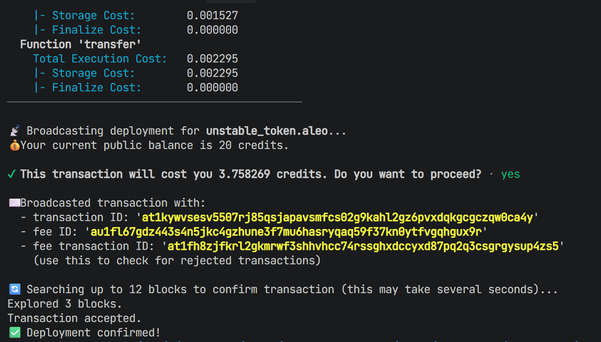
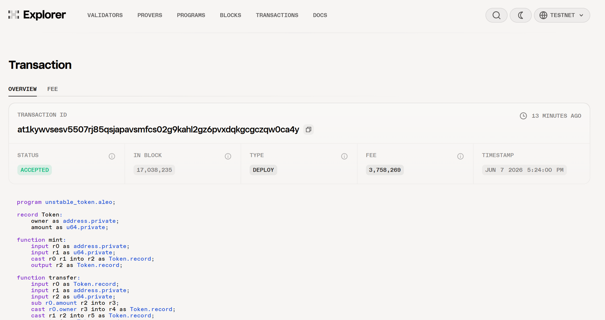
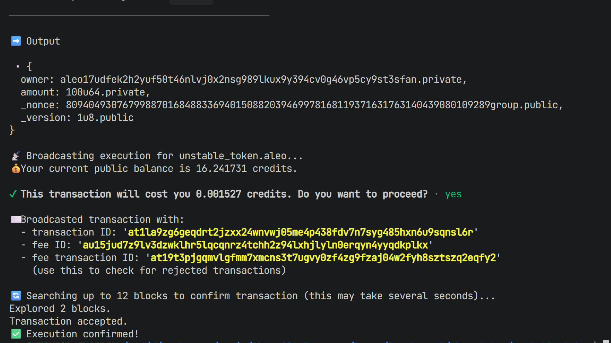
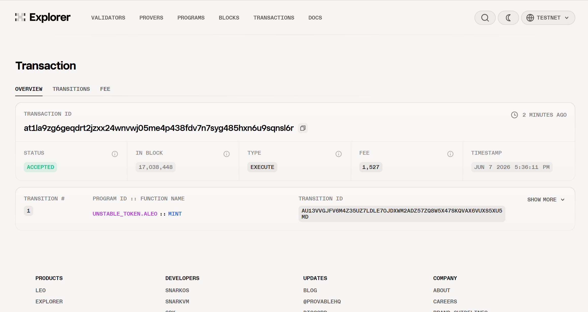

# Task 4 - 用起来：真实场景落地 

将你的 Aleo 应用部署到测试网并完成一次链上交互，提交相关代码，测试网合约地址和链上交互截图。

## 部署过程

1. 进入aleo-token/unstable_token目录，创建`.env`文件，将PRIVATE_KEY设置为钱包的私钥：

```
ENDPOINT=https://api.explorer.provable.com/v1
NETWORK=testnet
PRIVATE_KEY=user1PrivateKey
```

2. 然后执行部署命令：

```
leo deploy --broadcast --consensus-version 14
```

成功后会显示如下：



3. 通过transaction Id可以在Explorer网站上查询到部署信息：



## 链上交互

1. 使用leo命令执行mint函数：

```
leo execute mint aleo17udfek2h2yuf50t46nlvj0x2nsg989lkux9y394cv0g46vp5cy9st3sfan 100u64 --broadcast
```

成功后显示如下：



2. 然后到Explorer网站上查询相应的transaction Id：


