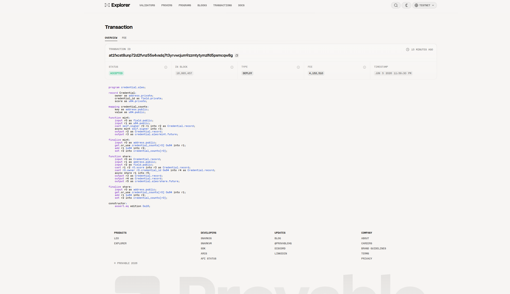
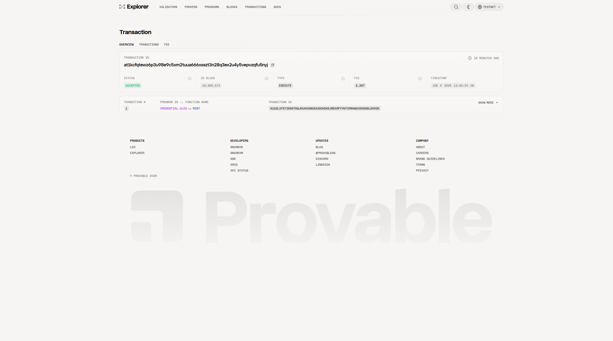
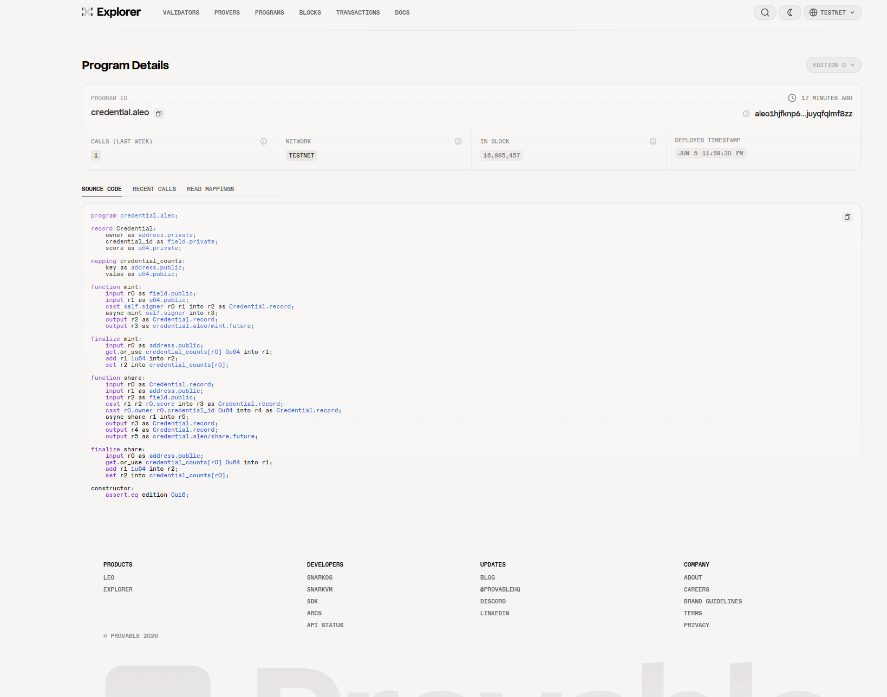

# Task 4 - 用起来：真实场景落地

> 将 Aleo 应用部署到测试网并完成一次链上交互

## 项目名称

**Private Credential Vault（隐私凭证保险库）**

## 程序信息

| 项目 | 内容 |
|------|------|
| 程序名 | `credential.aleo` |
| 部署者地址 | `aleo18kvx4atvn22j6qrnt8efhzskp5lhk3re0c0ewnp9z3a9tmcreyrsszx2cd` |
| 部署交易 ID | `at1fxcst8unp72d2fvnz55s4vsdq7t3yrvwcjum9zzmtytymzlfd5psmcqw8g` |
| 执行交易 ID | `at1kcfqtewz6p3u98e9c5xm2tuua666xsszt3n28q3ex2u4y5vepvzqfu5nyj` |
| 测试网 | Aleo Testnet |
| 程序大小 | 1.19 KB / 500.00 KB |

## 合约功能

| 函数 | 说明 | 隐私特性 |
|------|------|----------|
| `mint` | 铸造新的私有凭证 | 返回私有 Record，评分仅拥有者可见 |
| `share` | 分享凭证给他人 | 消耗原始凭证，生成新 Record |
| `constructor` | 防止合约升级 | `@noupgrade` 保证 |

## 链上交互记录

### 执行 `mint` 函数

铸造了一个隐私凭证，参数如下：

| 参数 | 值 |
|------|----|
| `credential_id` | `123field` |
| `score` | `95u64` |

**输出：**
- 私有 Record `Credential`（包含 `owner`, `credential_id`, `score` 字段，均为 `.private`）
- `Future`（用于更新链上公共 mapping `credential_counts`）

**费用：** 0.002297 credits

## 部署截图

> 截图来自 [Aleo Testnet Explorer](https://testnet.explorer.provable.com)

### 1. 部署交易截图

### 2. 执行交易截图（mint 函数）

### 3. 程序页面截图

## 项目源码

- Leo 合约：`task3_demo/program/src/main.leo`
- 前端应用：`task3_demo/frontend/`