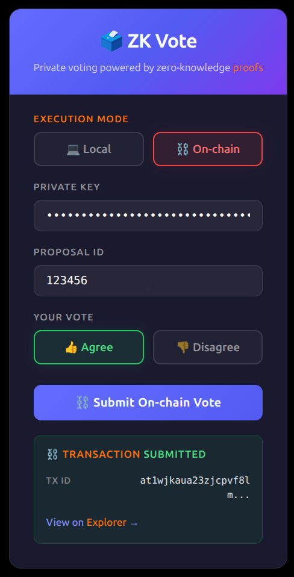
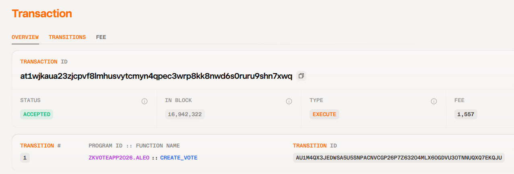

# Task 4 - 用起来：真实场景落地 

将你的 Aleo 应用部署到测试网并完成一次链上交互，提交相关代码，测试网合约地址和链上交互截图。

```leo
program zkvoteapp2026.aleo {
    // Simple record for tracking votes
    record VoteRecord {
        owner: address,
        proposal_id: field,
        vote_value: bool,  // true = agree, false = disagree
    }

    // Required constructor for ConsensusVersion::V9
    @noupgrade
    constructor() {}

    // Create a new vote record
    // fn is the entrypoint for creating records on Aleo
    fn create_vote(public proposal_id: field, public vote_value: bool) -> VoteRecord {
        return VoteRecord {
            owner: self.signer,
            proposal_id,
            vote_value,
        };
    }
}
```

## Deploy - `leo deploy --network testnet --broadcast`

- transaction ID: 'at13fr4rjdhr586mlmrm2zkfujhv7gw423adewgvyfr9ym7dggzyqzsxnw7dk'
- fee ID: 'au1meemtzt5u60gqss3c3vduxm6vthk5r6hlfkmsu2jllnl5p4ja59sj8uxsl'
- fee transaction ID: 'at1et3g3e25ktzh8dqjpz0hwqaj6m06z65c9ag7x7cgv7ghyeywquqqcgm57j'

## ZKVOTEAPP_NAME = "zkvoteapp2026.aleo"


## Transaction - at1wjkaua23zjcpvf8lmhusvytcmyn4qpec3wrp8kk8nwd6s0ruru9shn7xwq

