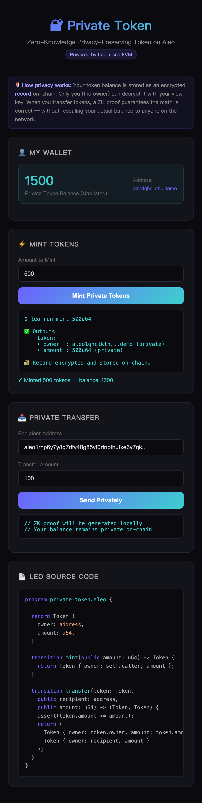
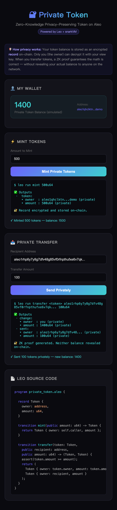

# Task 3 - 建起来：从程序到 dApp

基于 Leo 和前端完成一个可交互的隐私小应用，请提交代码文件和demo截图。

---

## 项目：Private Token dApp

一个基于 Aleo 的隐私代币系统，展示零知识证明如何实现"余额私有但转账可验证"的核心特性。

### Leo 合约：`private_token.aleo`

```leo
program private_token.aleo {

    // Token record: 链上加密存储，只有 owner 用 view key 才能解密查看 amount
    record Token {
        owner: address,
        amount: u64,
    }

    // 铸造代币：调用者获得私有 Token，amount 作为 public 参数传入
    transition mint(public amount: u64) -> Token {
        return Token {
            owner: self.caller,
            amount: amount,
        };
    }

    // 私密转账：通过 ZK 证明保证 sender 余额足够，但余额本身不上链公开
    transition transfer(
        token: Token,
        public recipient: address,
        public amount: u64
    ) -> (Token, Token) {
        assert(token.amount >= amount);

        let change: Token = Token {
            owner: token.owner,
            amount: token.amount - amount,
        };

        let sent: Token = Token {
            owner: recipient,
            amount: amount,
        };

        return (change, sent);
    }

    // 合并同一 owner 的两个 Token
    transition combine(first: Token, second: Token) -> Token {
        assert_eq(first.owner, second.owner);
        return Token {
            owner: first.owner,
            amount: first.amount + second.amount,
        };
    }
}
```

### 前端界面

前端使用原生 HTML + CSS + JavaScript 构建，模拟与 Leo 程序的交互：
- 展示私有代币余额（本地加密，不上链明文）
- Mint 按钮：调用 `leo run mint <amount>u64`
- Transfer 按钮：调用 `leo run transfer <token> <recipient> <amount>u64`
- 实时显示 Leo CLI 输出和生成的加密 Record

### 运行方式

```bash
# 编译 Leo 合约
leo build

# 铸造 500 代币
leo run mint 500u64

# 转账 100 代币
leo run transfer <token_record> aleo1recipient... 100u64

# 打开前端
open frontend/index.html
```

### Demo 截图

**Mint 操作** — 铸造 500 个私有代币，链上以密文存储：



**Transfer 操作** — 私密转账 100 个代币，余额不上链明文：



### 隐私原理

| 操作 | 链上可见内容 | 链上隐藏内容 |
|------|------------|------------|
| Mint | 调用者地址（public）、amount | — |
| Transfer | recipient 地址、amount | sender 余额、sender 地址 |
| Combine | — | 两个 token 的余额 |

核心：`Token` 是 **record**，以密文存储在链上。转账时，Leo 生成一个零知识证明，证明"我有足够的余额"，而不需要暴露余额的具体数值。
