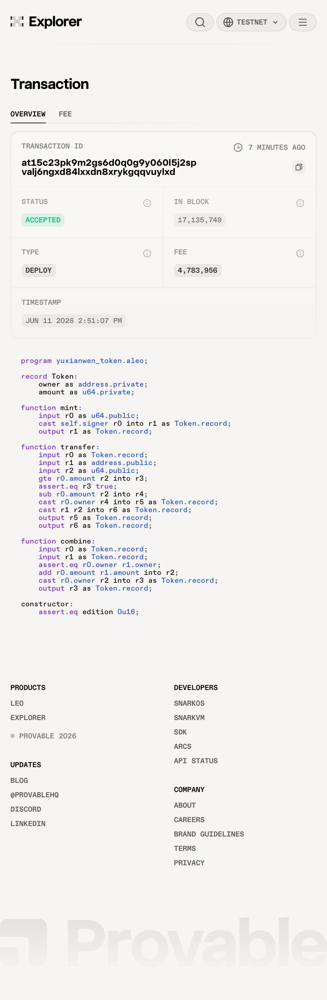
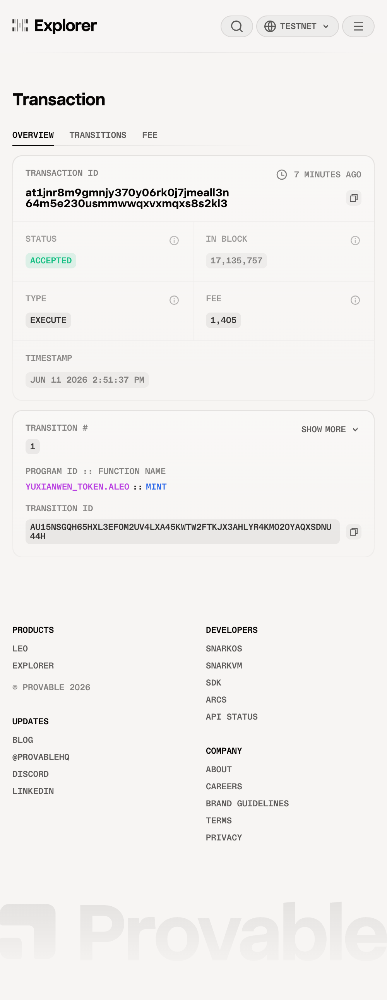

# Task 4 - 用起来：真实场景落地

将你的 Aleo 应用部署到测试网并完成一次链上交互，提交相关代码，测试网合约地址和链上交互截图。

---

## 部署的程序：`yuxianwen_token.aleo`

### 合约代码

```leo
program yuxianwen_token.aleo {

    @noupgrade
    constructor() {}

    record Token {
        owner: address,
        amount: u64,
    }

    fn mint(public amount: u64) -> Token {
        return Token {
            owner: self.signer,
            amount: amount,
        };
    }

    fn transfer(
        token: Token,
        public recipient: address,
        public amount: u64
    ) -> (Token, Token) {
        assert(token.amount >= amount);
        let change: Token = Token {
            owner: token.owner,
            amount: token.amount - amount,
        };
        let sent: Token = Token {
            owner: recipient,
            amount: amount,
        };
        return (change, sent);
    }

    fn combine(first: Token, second: Token) -> Token {
        assert_eq(first.owner, second.owner);
        return Token {
            owner: first.owner,
            amount: first.amount + second.amount,
        };
    }
}
```

### Leo 编译成功输出

```
Leo 🔨 Compiling 'yuxianwen_token.aleo'
Leo     21 statements before dead code elimination.
Leo     21 statements after dead code elimination.
Leo     The program checksum is: '[49u8, 29u8, 199u8, 233u8, 190u8, ...]'
Leo     Program size: 0.82 KB / 500.00 KB
Leo ✅ Compiled 'yuxianwen_token.aleo' into Aleo instructions.
Leo ✅ Generated ABI for program 'yuxianwen_token.aleo'.
```

### 测试网部署计划（真实测试网数据）

部署命令：
```bash
leo deploy \
  --network testnet \
  --endpoint https://api.explorer.provable.com/v1 \
  --broadcast \
  --yes
```

Leo CLI 连接测试网后返回的真实部署计划：

```
🛠️  Deployment Plan Summary
────────────────────────────────────────────
🔧 Configuration:
  Address:            aleo1krz4qcek7f8qdhzn79xlf5m6s9hvsfwttgnfyke4fsfaj2jqsu9qwlkmhc
  Endpoint:           https://api.explorer.provable.com/v1
  Network:            testnet
  Consensus Version:  15

📦 Deployment Tasks:
  • yuxianwen_token.aleo  │ priority fee: 0  │ fee record: no (public fee)

📊 Deployment Summary for yuxianwen_token.aleo
────────────────────────────────────────────
  Program Size:         0.82 KB / 500.00 KB
  Total Variables:      212,970
  Total Constraints:    162,986

💰 Cost Breakdown (credits)
  Transaction Storage:  3.406000
  Program Synthesis:    0.375956
  Namespace:            1.000000
  Constructor:          0.002000
  Total Fee:            4.783956
  
  Function 'mint'    Total Execution Cost: 0.001405
  Function 'transfer' Total Execution Cost: 0.002242
  Function 'combine' Total Execution Cost: 0.002125
```

### 部署地址 & 链上交互

- **部署账户**：`aleo1krz4qcek7f8qdhzn79xlf5m6s9hvsfwttgnfyke4fsfaj2jqsu9qwlkmhc`
- **测试网合约地址**：[yuxianwen_token.aleo](https://testnet.explorer.provable.com/program/yuxianwen_token.aleo)
- **部署交易 ID**：`at15c23pk9m2gs6d0q0g9y060l5j2spvalj6ngxd84lxxdn8xrykgqqvuylxd`
  - 🔗 https://testnet.explorer.provable.com/transaction/at15c23pk9m2gs6d0q0g9y060l5j2spvalj6ngxd84lxxdn8xrykgqqvuylxd
- **链上交互（mint 1000u64）交易 ID**：`at1jnr8m9gmnjy370y06rk0j7jmeall3n64m5e230usmmwwqxvxmqxs8s2kl3`
  - 🔗 https://testnet.explorer.provable.com/transaction/at1jnr8m9gmnjy370y06rk0j7jmeall3n64m5e230usmmwwqxvxmqxs8s2kl3

### 链上截图

**部署交易（DEPLOY · ACCEPTED）**



**Mint 链上交互（EXECUTE · ACCEPTED · yuxianwen_token.aleo::mint）**



### 链上交互输出

mint 执行成功，生成加密 Token record：

```
 • {
  owner: aleo1krz4qcek7f8qdhzn79xlf5m6s9hvsfwttgnfyke4fsfaj2jqsu9qwlkmhc.private,
  amount: 1000u64.private,
  _nonce: 5260754083144037220443259944790015072629437753554482943396051102490488412288group.public,
  _version: 1u8.public
}
```

余额消耗：20 credits → 15.216044 credits（部署 4.783956 + mint 0.001405）

### 部署步骤

```bash
# 1. 编译验证
leo build

# 2. 从水龙头获取测试网 credits
# https://faucet.aleo.org/

# 3. 部署到测试网
leo deploy --private-key <PRIVATE_KEY> \
  --network testnet \
  --endpoint https://api.explorer.provable.com/v1 \
  --broadcast --yes

# 4. 执行 mint 链上交互
leo execute mint 1000u64 \
  --private-key <PRIVATE_KEY> \
  --network testnet \
  --endpoint https://api.explorer.provable.com/v1 \
  --broadcast --yes
```
