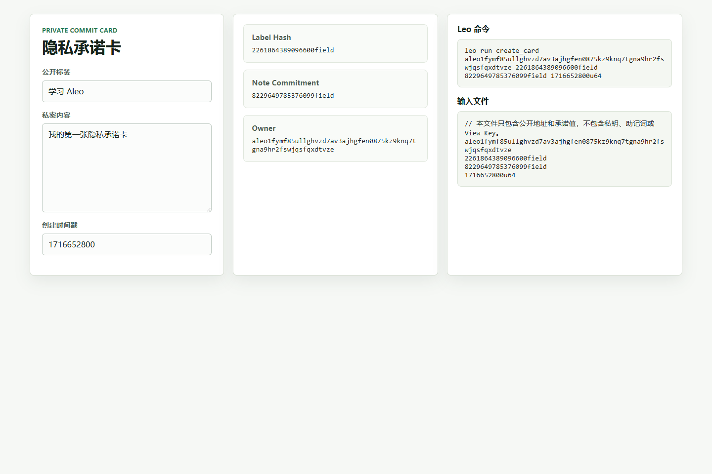

# Task 3 - 建起来：从程序到 dApp

基于 Leo 和前端完成一个可交互的隐私小应用，请提交代码文件和 demo 截图。

## 项目名称

Private Commit Card 隐私承诺卡

## 项目说明

这个 dApp 用来演示“私密内容不上链，只提交承诺值”的流程。

用户在前端输入：

- 公开标签；
- 私密内容；
- 创建时间戳。

前端会生成两个 Leo 可用的 `field` 值：

- `label_hash`：公开标签的哈希形式；
- `note_commitment`：私密内容的承诺值。

Leo 程序接收 `owner`、`label_hash`、`note_commitment` 和 `created_at`，然后生成一个归 owner 控制的私有 `Card` record。

## 代码位置

```text
learn/yuzhiyang1/private_commit_card/
```

主要文件：

```text
private_commit_card/
├── program.json
├── src/main.leo
├── inputs/private_commit_card.in
├── frontend/
│   ├── package.json
│   ├── index.html
│   └── src/
│       ├── App.tsx
│       ├── commitment.ts
│       ├── commitment.test.ts
│       ├── main.tsx
│       └── styles.css
└── screenshots/task3-demo.png
```

## 运行前端

```powershell
cd learn\yuzhiyang1\private_commit_card\frontend
npm install
npm run dev
```

打开：

```text
http://127.0.0.1:5173/
```

## 前端测试和构建

```powershell
cd learn\yuzhiyang1\private_commit_card\frontend
npm test -- --run
npm run build
```

本地验证结果：

```text
Test Files  1 passed (1)
Tests       3 passed (3)
vite build 通过
```

## Leo 本地运行

```powershell
cd learn\yuzhiyang1\private_commit_card
leo run create_card aleo1fymf85ullghvzd7av3ajhgfen0875kz9knq7tgna9hr2fswjqsfqxdtvze 2261864389096600field 8229649785376099field 1716652800u64
```

输出中会生成一个私有 `Card` record，包含：

```text
owner: aleo1fymf85ullghvzd7av3ajhgfen0875kz9knq7tgna9hr2fswjqsfqxdtvze.private
label_hash: 2261864389096600field.private
note_commitment: 8229649785376099field.private
created_at: 1716652800u64.private
```

## Demo 截图



